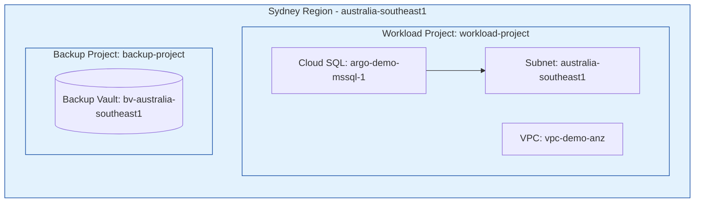

# Google Cloud SQL DR: Architecture and Audit Documentation

This repository houses the Terraform configuration documenting the "as-is" deployment of the Cloud SQL database instance and associated policies for the **argo-svc-dev** environments.

This documentation serves as an architectural design record for audit, security, and compliance professionals.

---

## 1. Executive Summary

The entire infrastructure and all backup storage locations are deployed **exclusively within the borders of Australia**. 

*   **Workload Location**: Sydney, Australia (`australia-southeast1`)
*   **Backup Vault Location**: Sydney, Australia (`australia-southeast1`)
*   **Disaster Recovery/Cloning Strategy**: Backups are written to the Sydney Backup Vault (`bv-australia-southeast1`) and cloned instances are provisioned in the same region (`australia-southeast1`) for dev-test validation.



---

## 2. Project Layout and Separation of Concerns

The deployment splits workloads and backup management into two separate Google Cloud projects to enforce a strict boundary for security control:

1.  **Workload Project (`workload-project`)**
    *   Houses the active database instance and local networking.
2.  **Backup Project (`backup-project`)**
    *   Houses the Backup Vault (storage destination).

---

## 3. Infrastructure & Backup Details

### 3.1. Workload Environments (Sydney, `australia-southeast1`)

One Cloud SQL database instance is running, attached to the private network `vpc-demo-anz`:

| Instance Name | Database Version | Machine Tier | Storage | IP Assignment |
| :--- | :--- | :--- | :--- | :--- |
| **argo-demo-mssql-1** | SQL Server 2025 Standard | `db-custom-2-8192` (2 vCPU, 8 GB, HA) | 100 GB SSD (Private Network Only) | DHCP (Private Subnet) |

### 3.2. Centralised Backup Vaults

One centralised backup vault is defined:

*   **Sydney Vault (`australia-southeast1`)**
    *   **Vault ID**: `bv-australia-southeast1`
    *   **Minimum Enforced Retention Duration**: `1 day (86400s)` — Backups cannot be manually deleted within this timeframe.


### 3.3. Backup Schedules & Rules

The backup rules are configured to protect the Cloud SQL database instance:

#### Cloud SQL Backup Plan (`mssql-backup-plan`)
All rules are configured in the `Australia/Sydney` timezone, with snapshots executing in the window between midnight (00:00) and 06:00.

*   **Daily Backup Rule (`daily`)**: Daily backups retained for **14 days**.
*   **Weekly Backup Rule (`weekly`)**: Weekly backups (on Sundays) retained for **28 days** (4 weeks).
*   **Monthly Backup Rule (`monthly`)**: Monthly backups (on the 1st of each month) retained for **90 days** (3 months).

#### Database Transaction Log Backups
*   **Log Retention (PITR)**: Configured in the GCBDR backup plan via top-level `log_retention_days = 7`, enabling database transaction log backup and recovery support using only the backup vault.

#### Cloud SQL Backup Plan (Non-Production - `mssql-nonprod-backup-plan`)
This plan is configured for non-production databases but is currently not applied (unassociated) to any resource.
*   **Daily Backup Rule (`daily`)**: Daily backups retained for **7 days**.
### 3.4. Alerting & Monitoring

Cloud Monitoring alerting policies are defined in the backup project (`backup-project`):

1.  **Backup Failure Alert**: Triggers a notification if any audit log from `backupdr.googleapis.com` containing the method `"Backup"` is recorded with a severity of `ERROR` or higher.
2.  **Restore Event Alert**: Triggers a notification for any restore activity (both success and failure) from `backupdr.googleapis.com` containing the method `"Restore"`.
3.  **Notification Channel**: Emails alerts to `email@email.com`.
4.  **Log Analytics**: Enabled on the `_Default` log bucket in the backup project, allowing SQL-based analysis of the platform logs.

---

## 4. Dev-Test Clone Verification Testing

The `dev-test` directory contains a dedicated, isolated Terraform workspace for testing Cloud SQL database instance cloning/restoration for development and test use cases.

### 4.1. Dev-Test Clone Layout

*   **Clone Target**: Clones are restored to the Sydney region (`australia-southeast1`), zone `australia-southeast1-a` (same region/network as workload).
*   **Networking**: Cloned databases attach to the regional `australia-southeast1` subnet in VPC `vpc-demo-anz` in the workload project.
*   **Naming Convention**: Cloned instances are prefixed with `dev-` (i.e. `dev-argo-demo-mssql-1`).

### 4.2. Isolated Dev-Test Workspace Files

*   `dev-test/providers.tf`: Provider setup targeting Sydney/workload project.
*   `dev-test/variables.tf`: Configuration variables.
*   `dev-test/main.tf`: Cloned database resources.
*   `dev-test/scripts/generate_tfvars.py`: Python script querying GCP APIs to dynamically locate the latest backups.
*   `dev-test/run_dev_test.sh`: Main automation wrapper script.

### 4.3. How to Execute a Dev-Test Clone

To run the plan/apply:

1.  Navigate to the `dev-test` directory:
    ```bash
    cd dev-test
    ```
2.  Run the automation wrapper script:
    *   **To run a dry-run plan**:
        ```bash
        ./run_dev_test.sh
        ```
    *   **To execute the actual cloning**:
        ```bash
        ./run_dev_test.sh --apply
        ```
    *   **To clean up and destroy cloned workloads**:
        ```bash
        ./run_dev_test.sh --destroy
        ```
